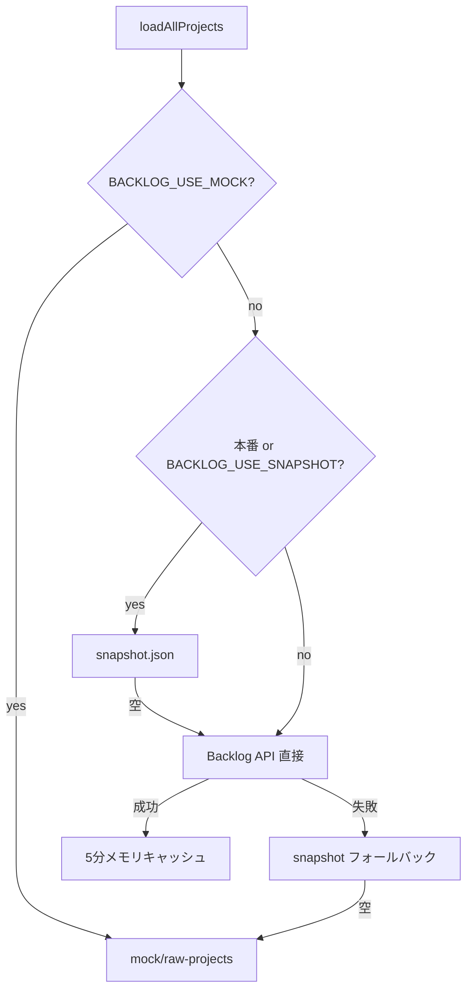
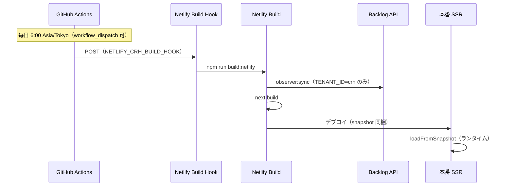

# 朝会支援UI（project-observer）仕様書

| 項目 | 内容 |
|------|------|
| 製品名（UI） | 朝会支援UI |
| パス | `/tools/project-observer` |
| コード上の識別子 | `project-observer` |
| 段階 | PoC（Proof of Concept） |
| マスタデータ | **Backlog**（本ツールは補助レイヤー） |

---

## 1. 目的と位置づけ

### 1.1 目的

ディレクターチームの**朝会**において、複数プロジェクトの状況を短時間で把握し、確認・優先付けの論点を揃える。

- 完了率・工数管理ツール**ではない**
- 「安全に進められるか」「認識が揃っているか」を**観測**する
- Backlog の正式情報を、ルールベースで**認知しやすく整理**して見せる

### 1.2 非目的（やらないこと）

- タスクの実行管理・スケジュール管理
- Backlog の代替（課題の編集・ステータス変更は Backlog 上で行う）
- クライアント向けレポートの自動生成
- 祝日を考慮した精密な SLA 管理（営業日は土日除外のみ）

### 1.3 基本原則

1. **Backlog が正式情報** — 判定の責任は Backlog 側
2. **ルールベース観測** — LLM 判定は使わない（PoC）
3. **ディレクター6名がスコープ** — 負荷・優先確認の「担当」表示はこの範囲
4. **新規未対応だけでは要注目にしない** — キーワード・次アクション・更新途切れで判断

---

## 2. 画面構成

### 2.1 ルート

| URL | 画面 | 説明 |
|-----|------|------|
| `/tools` | ツール一覧 | 全テナント共通。CRH のみ「朝会支援UI」カードを表示 |
| `/tools/project-observer` | 朝会支援UI（一覧） | 全プロジェクトのサマリー・チーム負荷・優先確認 |
| `/tools/project-observer/projects/[id]` | プロジェクト詳細 | 1 プロジェクトの深掘りパネル群 |

`[id]` は Backlog の **projectKey**（例: `NAITOHOUSE_CRH`）。

**ツール一覧からの導線:** `app/tools/page.tsx` で `TENANT_ID === 'crh'` のときのみ `/tools/project-observer/` へのリンクカードを出す（汎用 Netlify サイトでは非表示）。

### 2.2 一覧画面の構成（上から）

| ブロック | コンポーネント | 内容 |
|----------|----------------|------|
| 免責 | `ObservationDisclaimer` | Backlog がマスタである旨 |
| 鮮度 | `DataFreshnessBanner` | 観測時刻（`snapshot.json` の `observedAt`・**Asia/Tokyo 表示**）・バッチ想定（毎日 6:00 JST） |
| 凡例 | `StatusLegend` | 共有ステータス・優先ルール |
| 優先確認 | `DirectorPromptsPanel` | チーム全体の high 優先プロンプト（初期6件・「もっと見る」で6件ずつ追加） |
| 担当者別の割り当て課題 | `DirectorTodayActions` | Backlog 担当がディレクターの課題（記法あり＋要整理課題）を担当者別に一覧 |
| プロジェクト全体計測 | `ProjectCard` × N | 案件カード（共有ステータス・記法件数。**0件の指標は非表示**） |
| チーム状態 | `FleetSummary` | 要注目・注意の件数サマリー |

### 2.3 詳細画面の構成

| パネル | 内容 |
|--------|------|
| `SafetyReadinessPanel` | 共有ステータス・進行安全性・次アクション・共有観測文 |
| 観測メモ | `observerNote`（同期時の説明文） |
| 指標ピル | 要件未確定 / 確認待ち / 未返信 / 要確認 |
| `StatusReasonsPanel` | ステータス理由一覧 |
| `SharingGapPanel` | 共有途切れシグナル |
| `DirectorPromptsPanel` | 案件内の確認促し |
| `AssigneeLoadPanel` | ディレクター別負荷テーブル |
| `ObservedIssuesPanel` | 観測された課題 |
| その他 | 現在状態・文脈メモ・懸念コメント・リスクタイムライン |

### 2.4 UI 表記

- 製品名: **朝会支援UI**
- 常時ダークテーマ（`layout.tsx` で `className="dark"` を付与）
- 課題キーは Backlog 課題 URL へリンク（`BACKLOG_SPACE` 設定時）
- **観測時刻:** `tenants/{TENANT_ID}/data/snapshot.json` の `observedAt`（UTC ISO）を `lib/format.ts` の `formatDateTime` で **`OBSERVATION_CONFIG.batchTimezone`（Asia/Tokyo）** に変換して表示。Netlify ランタイムの TZ には依存しない

---

## 3. データ取得

### 3.1 取得モード



| 環境 | 優先データ源 |
|------|----------------|
| `BACKLOG_USE_MOCK=true` または API 未設定 | モック |
| `tenants/{TENANT_ID}/data/snapshot.json` あり、または `BACKLOG_USE_SNAPSHOT=true` | スナップショット → 失敗時 API → モック |
| 上記以外（Netlify ランタイム等） | Backlog API（5分メモリキャッシュ）→ スナップショット → モック |
| `BACKLOG_USE_LIVE=true` | スナップショットを無視して API 優先 |

### 3.2 環境変数

| 変数 | 必須 | 説明 |
|------|------|------|
| `TENANT_ID` | Netlify ごと | `crh` / `generic`（既定: `crh`） |
| `BACKLOG_SPACE` | 実データ時 | `https://xxx.backlog.jp` またはスペース ID |
| `BACKLOG_API_KEY` | 実データ時 | API キー |
| `BACKLOG_PROJECT_IDS` | 実データ時 | カンマ区切り projectKey |
| `BACKLOG_INTERNAL_EMAIL_DOMAIN` | 任意 | 社内判定用（既定: `creativehope.jp`） |
| `BACKLOG_USE_MOCK` | 任意 | `true` でモック強制 |
| `BACKLOG_USE_SNAPSHOT` | 任意 | `true` でスナップショット優先 |
| `BACKLOG_USE_LIVE` | 任意 | `true` でランタイム API 優先 |

### 3.3 本番運用（CRH / Netlify）

CRH サイト（`TENANT_ID=crh`）の想定。**閲覧時は Backlog API を叩かず**、ビルド時に生成したスナップショットを読む。



| 段階 | 内容 |
|------|------|
| ① スケジュール | `.github/workflows/crh-observer-daily.yml` — `cron: 0 6 * * *` + `timezone: Asia/Tokyo`。Repository **Variable** `NETLIFY_CRH_BUILD_HOOK` に Hook URL |
| ② ビルド開始 | Netlify Build Hook（UI で作成。例: `Daily observer sync`） |
| ③ 同期 | `scripts/netlify-build.js`（`npm run build:netlify`）— **`TENANT_ID=crh` のときだけ** `npm run observer:sync` |
| ④ ビルド | `npm run build` → `tenants/crh/data/snapshot.json` がデプロイ成果物に含まれる |
| ⑤ 閲覧 | `BACKLOG_USE_SNAPSHOT=true` 推奨。`loadAllProjects()` がスナップショットの `observedAt` を観測時刻として表示 |

**`netlify.toml` と UI の Build command:** リポジトリの `netlify.toml` の `command` が **UI 設定より優先**される。共通設定は次のとおり。

```toml
[build]
  command = "npm run build:netlify"
```

汎用サイト（`TENANT_ID=generic`）では `build:netlify` 内で **sync をスキップ**し、`npm run build` のみ実行。

**手動同期（ローカル）:**

```bash
TENANT_ID=crh npm run observer:sync   # → tenants/crh/data/snapshot.json
```

コミットは任意（本番 CRH はビルド時 sync が主。git 上の JSON はフォールバック・開発用）。

**その他:**

- **Netlify**: `@netlify/plugin-nextjs` で SSR。`/tools/project-observer` は `force-dynamic`
- `scripts/sync-project-observer.ts` → `tenants/{TENANT_ID}/data/snapshot.json`
- URL は **`trailingSlash: true`** のため末尾 `/` 必須（例: `.../projects/NAITOHOUSE_CRH/`）
- 静的 export が必要な場合のみ `npm run build:static`（Xserver 等）

**Netlify 環境変数（CRH サイト例）:**

```
TENANT_ID=crh
BACKLOG_USE_SNAPSHOT=true
BACKLOG_SPACE=...
BACKLOG_API_KEY=...
BACKLOG_PROJECT_IDS=...
```

ビルドログに `[netlify-build] TENANT_ID=crh → running observer:sync` と `Wrote tenants/crh/data/snapshot.json` が出ていれば同期成功。

### 3.4 Backlog 同期の制限（PoC）

| 項目 | 値 |
|------|-----|
| コメント取得対象課題 | 対象ステータス（処理中・未対応）のうち**更新日が新しい順で最大 40 件** |
| 課題あたりコメント | **最新 50 件**（`order=desc`）。未返信等の解析は先頭（最新）を利用 |
| コメント解析 | 課題本文 + 上記コメントを結合 |
| 状態・担当変更日 | コメントの `changeLog`（`field`: `status` / `assigner` 等）の**直近** `created`。50 件内に無い場合は課題 `updated` にフォールバック |
| 営業日 | 土日除外のみ（祝日なし） |
| API レート | コメント取得ごとに約 80ms 待機 |

---

## 4. 観測スコープ

### 4.1 ディレクターチーム（負荷・担当表示）

Backlog 表示名が**完全一致**するユーザーのみ。

| ID | Backlog 表示名 |
|----|----------------|
| nakaya | CRH_中谷信明 |
| nakano | CRH_中野 絵理子 |
| masui | CRH_増位 |
| urabe | CRH_浦辺良亮 |
| kuge | 久下 しおり |
| kosugi | 小杉 慶来 |

定義: `lib/observation/config.ts` の `DIRECTOR_TEAM`。

### 4.2 観測対象の課題（担当・登録者）

同期・集計・一覧の対象は、**対象ステータス**（§4.3）かつ次を満たす課題のみ（いずれかで可）:

- **担当者**（`assignee`）の表示名が `DIRECTOR_TEAM` と完全一致
- **登録者**（`createdUser`）の表示名が `DIRECTOR_TEAM` と完全一致

実装: `isDirectorTeamScopedIssue`（`lib/observation/config.ts`）。Backlog 同期時にフィルタ。

### 4.3 観測対象の課題（ステータス）

Backlog 課題ステータス（表示名）が次のいずれか**のみ**対象:

| ステータス |
|------------|
| 処理中 |
| 未対応 |

**完了扱い（対象外）:** `処理済` · `完了`（ほかのステータス名も対象外）

実装: `isAllowedObservationIssueStatus`（`lib/observation/issue-status-scope.ts`）。

### 4.4 観測対象外の課題（件名）

Backlog 課題の**件名（summary）**に次の文字列を**含む**課題は、集計・一覧・プロンプトのいずれにも含めない。

| 除外文字列 |
|------------|
| 工数管理 |
| 工数計上 |

実装: `lib/observation/issue-exclusions.ts`（Backlog 同期時にフィルタ。スナップショット読込時は観測課題・タイムライン等を再フィルタ）。

### 4.5 社内ユーザー判定（未返信など）

次のいずれか:

- メールアドレスが `*@{BACKLOG_INTERNAL_EMAIL_DOMAIN}` で終わる
- 表示名が `DIRECTOR_TEAM` のいずれかと一致

---

## 5. 共有ステータス（ShareStatus）

**優先: 要注目 > 注意 > 安定**

### 5.1 要注目（attention）

案件内に以下いずれかが 1 件以上（**新規未対応のみは含めない**）:

| シグナル | 検出方法（課題本文 + 最新10コメント） |
|----------|--------------------------------------|
| 未FIX | `/未FIX|未fix|まだFIX/i` |
| 暫定対応 | `/暫定|一旦対応|仮対応/i` |
| 要件未確定 | `/要件未確定|要件未決/i` |
| 仕様未決 | `/仕様未決|仕様未確定|仕様未合意/i` |
| 次アクション不明 | 有効な次アクション記載が案件内にない |

### 5.2 注意（caution）

要注目でない場合、次のいずれか:

- **3 営業日以上**、課題更新・コメント・状態・担当変更のいずれかが途切れている（複合条件あり）
- 注意理由が **2 件以上**
- 更新・コメント・状態・担当・次アクションがすべて 3 営業日以上途切れ → 「状況共有が途切れている」

「更新」の定義: Backlog **課題の `updated`**（案件内最新）。

### 5.3 安定（stable）

- 要注目条件なし
- **3 営業日以内**に課題更新あり
- 案件として**次アクションが明記**されている（後述）

---

## 6. 次アクション

### 6.1 有効な次アクション

課題本文・コメントから**最後の意味のある行**を抽出し、次を満たすとき有効:

- 6 文字未満は無効
- NG パターンに一致しない（例: `確認します` のみ、`一旦対応`、`検討中` など）

定義: `lib/observation/next-action.ts`, `config.ts` の `nextActionNgPatterns`。

### 6.2 派生指標

| 指標 | ルール |
|------|--------|
| `nextActionClarity` | 無し→`unclear`、あり+更新が新しい→`clear`、それ以外→`partial` |
| `proceedSafety` | 要注目/不明瞭→`hold`、注意/部分→`careful`、それ以外→`safe` |

※ 一覧の `ProjectCard` では慎重/次アクションバッジは**非表示**（詳細画面の `SafetyReadinessPanel` では表示）。

---

## 7. 担当者アクション（ディレクター向け）— コメント記法

自然文推定・「社内最終コメント＝返信待ち」は廃止。Backlog コメント（最新 `commentParseLimit` 件、既定 10）の **明示ラベル** のみ読む。

判定: `lib/observation/comment-notation.ts`（`sync-project.ts` から利用）。

### 7.1 正式記法

| ラベル | 意味 |
|--------|------|
| `要確認：` | ディレクター判断・要件確認が必要 |
| `社内待ち：` | デザイン・実装・社内確認など（待機） |
| `外部待ち：` | クライアント・発注・承認など（待機） |
| `次アクション：` | 次に誰が何をするか整理済み |

全角 `：` / 半角 `:` どちらも可。

### 7.2 UI フラグ

| 記法 | フラグ |
|------|--------|
| `要確認：` | needsConfirmation |
| `外部待ち：` | externalWait |
| `社内待ち：` | internalWait |
| `次アクション：` | hasNextAction |

**要注目・注意**（危険状態）は課題本文の未FIX等（`issue-signals`）。記法の要確認とは独立。

### 7.3 状態未記載・要整理課題

ディレクター担当の観測対象課題のうち、最新コメント（`commentParseLimit` 件）に **4記法のいずれもない** もの。

| UI | フィールド / ラベル |
|----|---------------------|
| プロジェクト全体計測 | `statusUnrecordedCount` · 表示名 **状態未記載**（0件は非表示） |
| 担当者別一覧 | `needsOrganization: true` · 行タグ **要整理課題** |

Backlog に新記法は追加しない（UI 専用ラベル）。記法を書けば要整理から外れる。

### 7.4 次アクション（案件安定性）

`次アクション：` がある場合のみ `nextActionValid === true`。

### 7.5 要注目カウント（needsReview）

- 課題担当がディレクター
- 課題の共有ステータスが `attention` または `caution`

### 7.6 認知負荷（cognitiveLoad）

※ 要整理課題は認知負荷の合計に含めない（要確認 + 要注目系のみ）。

待機は含めない。担当者ごとに `要確認 + 要注目系` の合計:

| 合計 | レベル |
|------|--------|
| ≥ 7 | high |
| ≥ 4 | elevated |
| ≥ 2 | moderate |
| それ以外 | light |

---

## 8. 優先確認（DirectorPrompt）

### 8.1 一覧「チーム全体 — 優先確認」

- 全プロジェクトの `directorPrompts` から `priority === 'high'` のみ（件数上限なし）
- UI は初期 **6 件** 表示。「もっと見る」で **6 件ずつ** 追加、「閉じる」で初期表示に戻す
- 各カードは **Backlog 課題 URL** へリンク（`issueKey` 使用）

### 8.2 プロンプト生成

| source | 意味 | forDirector（担当行） |
|--------|------|------------------------|
| `status_change` | 非安定の観測課題（最大3件/案件） | 課題の Backlog 担当が**スコープ内ディレクター**のときのみ表示 |
| `assignee_change` | 負荷上 `suggestedNext` があるディレクター | そのディレクター名 |

表示: `担当: {名前}`（スコープ外・未設定の場合は行ごと非表示）。

---

## 9. ディレクトリ構成

```
app/tools/project-observer/
├── SPEC.md                 # 本仕様書
├── page.tsx                # 一覧
├── layout.tsx              # メタデータ・ダーク強制・CSS
├── observer.css
├── projects/[id]/page.tsx  # 詳細
├── components/             # UI
├── lib/
│   ├── load-projects.ts    # データ入口
│   ├── format.ts           # 日時表示（Asia/Tokyo）
│   ├── evaluate-records.ts # 観測結果の組み立て
│   └── observation/        # 判定ロジック
│       ├── config.ts       # 定数・ディレクター一覧
│       ├── evaluate.ts     # 共有ステータス・負荷
│       └── next-action.ts
├── mock/                   # モックデータ
└── types/index.ts

tenants/
├── crh/
│   ├── config.ts           # DIRECTOR_TEAM 等
│   └── data/snapshot.json  # 本番 CRH 用スナップショット（ビルド時更新）
└── generic/
    └── config.ts

lib/backlog/                # Backlog API・同期
├── client.ts
├── sync-project.ts
├── issue-signals.ts
├── env.ts
└── business-days.ts

scripts/
├── sync-project-observer.ts
└── netlify-build.js        # Netlify 共通ビルド（crh のみ sync）

.github/workflows/
└── crh-observer-daily.yml  # 毎朝 6:00 JST → Build Hook
```

---

## 10. 開発・運用

### 10.1 ローカル開発

```bash
# .env.local に TENANT_ID=crh と BACKLOG_* を設定
npm run dev
# → http://localhost:3000/tools/project-observer
```

環境変数変更後は **dev サーバー再起動**が必要。Backlog 取得結果は **約5分キャッシュ**（`BACKLOG_USE_LIVE_IN_DEV=true` で開発時 API 直叩き可）。

### 10.2 Netlify ビルド（CRH）

```bash
# ローカルで Netlify と同じ流れを試す場合
TENANT_ID=crh npm run build:netlify
```

本番は Build Hook または push で `build:netlify` が走る。観測時刻が更新されない場合は Deploy log で `observer:sync` の有無を確認（`npm run build` のみだと git 上の古い `snapshot.json` のまま）。

### 10.3 毎日 6:00 JST バッチのセットアップ checklist

| # | 場所 | 設定 |
|---|------|------|
| 1 | Netlify（CRH） | 環境変数 `TENANT_ID=crh`, `BACKLOG_*`, `BACKLOG_USE_SNAPSHOT=true` |
| 2 | Netlify（CRH） | Build Hook 作成 → URL を GitHub Variable `NETLIFY_CRH_BUILD_HOOK` に登録 |
| 3 | GitHub | `.github/workflows/crh-observer-daily.yml` を default ブランチに含める |
| 4 | 確認 | Actions 手動実行 → Deploy log に sync → 本番の観測時刻が JST で更新 |

### 10.4 既知の制限・今後の拡張候補

- [x] コメント `changeLog` による状態・担当変更日（50 件窓。それ以前はフォールバック）
- [x] 毎日 6:00 JST バッチ（GitHub Actions → Build Hook → `build:netlify`）
- [x] 観測時刻の Asia/Tokyo 表示
- [x] CRH ツール一覧からの導線
- [ ] 祝日カレンダー対応の営業日
- [ ] 優先確認の `assignee_change` と課題キーの対応付け
- [ ] コメント解析対象課題数の設定化
- [ ] `outputFileTracingIncludes` でスナップショット同梱を明示（ホスティング変更時の保険）

---

## 11. 変更履歴（ドキュメント）

| 日付 | 内容 |
|------|------|
| 2026-05-19 | 本番運用: `build:netlify`・GitHub Actions 6:00 JST・Build Hook・観測時刻 TZ・CRH ツール一覧導線 |
| 2026-05-17 | 初版（朝会支援UI・Backlog 連携 PoC 時点の実装に基づく） |
